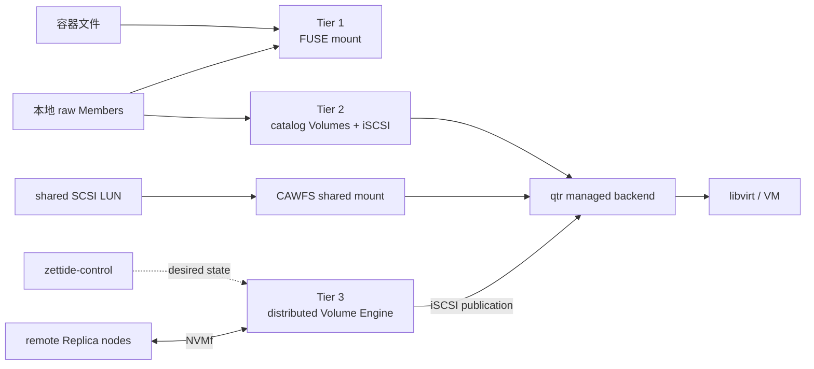
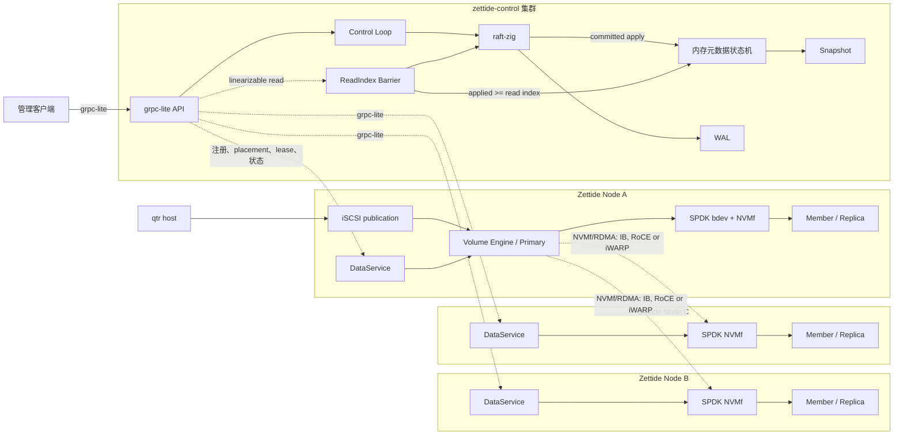

# 系统架构

> 状态：当前组件基础 + 目标集成架构

## 系统上下文

Tier 1 直接挂载文件系统。Tier 2 在一个存储节点上增加常驻服务、multi-Volume catalog、动态 Pool、block export 和 qtr attachment。Tier 3 在保持 VM-facing contract 的同时增加复制控制面和跨节点数据路径。

CAWFS shared-file profile 与 Tier 2/3 block path 并列：qtr 仍向 libvirt 提供
file disk，但持久身份是 CAWFS volume/image ID，host-local mount path 不是权威。
该 profile 的 image owner epoch 与 block Volume write epoch 是不同版本域。

## Tier 3 目标上下文

虚线表示目标集成。当前尚无 DataService、跨节点 Volume Engine 和 NVMf 数据路径。

## 组件职责

### zettide-control

目标职责：

- 保存 Pool、Volume、Node、Replica、placement、lease 和 epoch。
- 处理管理 API 和节点注册。
- 选择 Replica 放置位置与 primary。
- 比较 desired/observed state 并执行 reconciliation。
- 通过 Raft 提交所有权威元数据变更。

当前已实现 Pool、Node、Member 和 Volume metadata API/state machine，静态多 voter Raft runtime、WAL、snapshot、ReadIndex、grpc-lite transport 和恢复测试。Placement、Replica mutation、lease、reconciliation 和数据面装配尚未实现。

### raft-zig

职责：

- 复制控制面状态机命令。
- 持久化 HardState、日志、membership 和 snapshot。
- 提供 proposal callback 与 ReadIndex。
- 通过 grpc-lite persistent stream 传输 Raft 消息。

生产控制面必须配置持久 `data_dir`；空目录配置使用 MemoryStorage，不具备重启持久性。

### grpc-lite

职责：

- 承载管理、注册、heartbeat、reconciliation 和 Raft RPC。
- 提供 unary/streaming、deadline、metadata、流控和有界缓冲。
- 在 reactor 线程运行回调；业务逻辑不得阻塞回调线程。

grpc-lite 不负责数据副本复制，也不提供自动 RPC retry、负载均衡或 mTLS。

### zettide

当前职责：

- 管理容器、littlefs、对象层和 FUSE 前端。
- 管理 Member v3 格式、Pool topology、layout 和 control journal。
- 通过本地 `ReplicaEndpoint` 访问 Member 数据区域。
- 在本地三成员复制失败后冻结 writer。
- 管理 multi-Volume catalog、extent mapping、catalog data lease 和本地 writable Volume backend 的库级路径。
- 提供 managed SPDK runtime、bdev dispatcher、NVMe-oF initiator、异步 bdev provider 和 vhost-user-blk export 生命周期。

目标新增职责：

- 运行常驻 DataService、Volume Engine 和 SPDK reactor。
- 管理本地 Replica 与 NVMf namespace。
- 作为 initiator 访问远程 Replica。
- 按 protection policy 执行 primary 写入排序、quorum 提交、fencing 和 resync；默认 profile 为 2/3。
- 先为 Tier 2 管理 iSCSI target、publication 和本地保护迁移。

### SPDK/NVMf

目标职责：

- 将本地介质和 Replica 暴露为 bdev。
- 为 Replica 创建受控 NVMf namespace。
- 通过 NVMf/RDMA 传输跨节点数据；RDMA provider 可以使用 InfiniBand、RoCE 或兼容的 iWARP。
- 将 I/O completion 映射到明确的 durable flush/FUA 语义。

当前 managed SPDK application framework、bdev access、NVMe-oF initiator、异步 provider 和 vhost-user-blk controller 已有 focused tests。尚未形成常驻服务、受管 iSCSI/NVMf target 或端到端设备生命周期。

### qtr

当前职责：

- 管理 VM 的 file-backed 和 host block-device libvirt disk。
- 手动注册、扫描、连接和断开外部 iSCSI Volume。

目标新增职责：

- 使用稳定 Zettide Volume ID 请求幂等 publication。
- 管理 iSCSI login、稳定设备解析、libvirt attachment 和 detach 顺序。
- 重启后 reconcile publication、session/device 和 libvirt attachment。
- 在 Tier 3 接受调用方指定的目标 host 并 republish；不负责 VM host 调度或自动重启。

## 控制路径

1. 请求到达当前 `zettide-control` leader。
2. Leader 在 proposal 前完成权限、参数和幂等校验，并生成确定性命令。
3. Raft 多数派持久化并提交命令。
4. 本地状态机 apply 后返回结果。
5. Reconciler 根据 desired state 和节点上报生成幂等动作。
6. DataService 执行动作并上报 observed state。
7. 需要改变权威关系的结果再次通过 Raft 提交。

## Tier 1 数据路径

应用 syscall 经 FUSE/littlefs 访问容器文件或 raw Pool。该路径不依赖 qtr、SPDK daemon 或 `zettide-control`。

## Tier 2 数据路径

1. qtr 根据稳定 Volume ID 请求本 storage node 发布 Volume。
2. Zettide 将 catalog Volume 接入异步 SPDK bdev provider，并创建 iSCSI target/LUN。
3. qtr 登录 iSCSI、验证稳定设备身份并生成 libvirt block disk。
4. I/O 经 iSCSI、SPDK bdev、catalog extent mapping 到达本地 Member。
5. Detach 先持久化 detaching intent并移除 libvirt 使用，再释放 session 和 publication。

## Tier 3 数据路径

以下步骤描述默认 3/2 protection profile；其他 override 使用自身持久写阈值，只有数据协议支持该 profile 时才能激活。

1. qtr 通过当前 iSCSI publication 访问 Volume。
2. Publication 将块请求交给当前 primary Volume Engine。
3. Primary 检查 lease 和 write epoch。
4. Primary 将写入发送到本地及远程 Replica。
5. 至少两个 Replica 持久化 prepare/data record；随后至少两个 Replica 持久化 quorum commit certificate，primary 才确认成功。
6. 未确认的第三副本通过 journal/dirty ranges 后台追赶。

Raft 不进入这个逐 I/O 同步路径。

## 关键版本域

| 值 | 作用域 | 用途 |
| --- | --- | --- |
| Raft term | 控制面 Raft group | Raft leader 任期 |
| 本地 v3 Pool membership epoch | 一个本地 v3 Pool topology | Member 集合和角色版本 |
| Volume write epoch | 单个 Volume | Primary 写入 fencing |
| Replica generation | 单个 Replica 数据实例 | 区分重建后的数据代次 |
| Lease ID | 单次 primary 授权 | 区分具体授权实例 |
| Revision | 控制面状态 | 已 apply 的元数据版本 |
| CAWFS image owner epoch | 单个 shared qcow2 | 隔离旧 qtr/FUSE writer；接管前仍要求外部 hard fence |

这些值不得相互替代或隐式转换。
