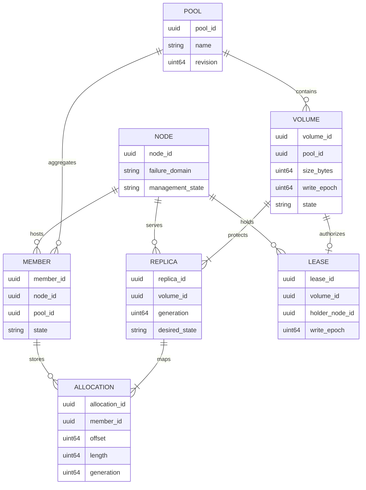
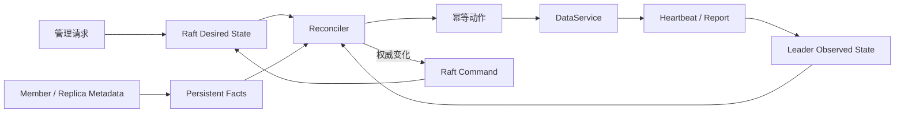
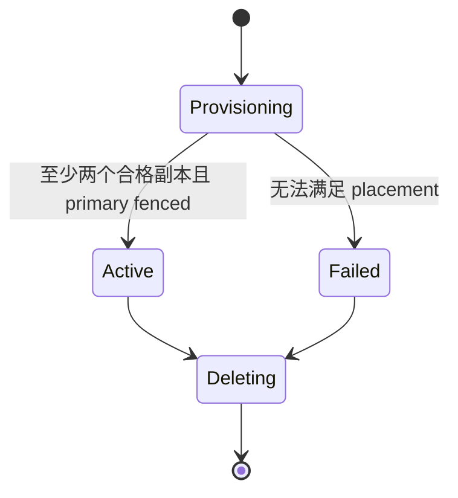

# 领域模型

> 状态：Pool 当前实现；其余为目标设计

## 模型边界

`zettide-control` 管理集群级元数据，不承载数据块。权威状态通过 Raft 复制，查询视图保存在内存，并由 WAL 和 snapshot 恢复。

控制面 Pool 是跨节点资源域。一个 Pool 包含多个 Volume；一个 Node 可以为一个或多个 Pool 提供本地 Member 容量；一个 Volume 的 Replica 分布在多个 Node 故障域。

## 核心实体

| 实体 | 关键职责 | 持久位置 |
| --- | --- | --- |
| Pool | Volume 命名空间、资源和策略边界 | Raft 状态机 |
| Volume | 容量、保护策略、生命周期、write epoch | Raft 状态机 |
| NodeRegistration | 节点身份、控制/NVMf endpoint、能力、故障域 | Raft 状态机 |
| MemberRegistration | 本地持久单元与控制面 Pool/Node 的绑定 | Raft 状态机 |
| ReplicaPlacement | Volume Replica 的目标 Node、角色和 generation | Raft 状态机 |
| ReplicaAllocation | Replica 在 Member 上不重叠的 extent/range | Raft 状态机 + Node 本地 catalog |
| VolumeLease | 当前 primary holder、lease ID、epoch 和授权边界 | Raft 状态机 |
| NodeObservation | incarnation、heartbeat、容量和运行状态 | 当前 leader 内存 |
| ReplicaObservation | 实际 generation、applied/committed position、健康和修复进度 | 当前 leader 内存 |
| ReconciliationAction | desired/observed 差异产生的幂等动作 | 派生任务；结果按需提交 Raft |

## 实体关系

## Desired、Observed 与 Persistent Facts

- Desired state 回答“系统应该是什么”。
- Observed state 回答“当前 leader 最近观察到什么”。
- Persistent facts 回答“节点重启后仍能从介质证明什么”。

Heartbeat 丢失可以将 Node 标记为 suspected，但不能直接删除 registration、提升 primary 或宣告数据丢失。任何写入权威变更必须形成 Raft command。

## 核心不变量

1. Pool、Volume、Node、Member 和 Replica ID 在各自作用域内唯一且不复用。
2. 一个 Volume 属于且只属于一个 Pool。
3. 一个 Replica 属于且只属于一个 Volume，并绑定一个 Node；其 allocation 映射到一个或多个不重叠 Member extent。
4. 同一 Volume 的多个 Replica 不得放在同一主机故障域。
5. 默认 Volume 具有三个目标 Replica，写 quorum 为两个。
6. Primary 必须是当前 placement 中的一个合格 Replica；任意两个合格 Replica 可以组成写 quorum。
7. 一个可写 Volume 至多有一个有效 primary lease。
8. Volume write epoch 单调递增，不回退、不复用。
9. 任何可能使旧 primary 与新 primary 并存的操作必须推进 epoch。
10. Replica generation 在重建后变化；旧 generation 的 endpoint 不得重新加入当前 placement。
11. Observed state 不能覆盖 desired state 或介质上的持久事实。
12. 修复中的 Replica 不参与写 quorum 或 primary 候选集合。
13. Placement 变更先建立新保护，再撤销仍承担 quorum 的旧 Replica。
14. Raft apply 必须确定、原子且无外部副作用。ID、时间和 placement 结果在 proposal 前确定。
15. 变更请求具有稳定 request ID；同 ID 不同语义必须返回冲突。

## Volume 生命周期与保护状态

状态分为三个正交字段：

- `lifecycle_state`：Provisioning、Active、Deleting、Failed。
- `availability_state`：Healthy、Degraded、ReadOnly、Unavailable。
- `operation_phase`：None、Fencing、Recovering、Repairing。

例如修复第三个副本时，Volume 可以同时是 `Active + Degraded + Repairing`。三副本合格才是 Healthy；只有两个合格副本时是 Degraded。对外展示按 Unavailable、ReadOnly、Degraded、Healthy 的可用性优先级呈现，并单独附带 operation phase。

## 当前实现与差距

当前 `zettide-control` 只实现 Pool：ID、名称、描述、创建时间和创建 revision。`PoolStateMachine` 已有 ID/name 索引、request history、快照与恢复。

Volume、Node、MemberRegistration、Replica、allocation、placement、lease、epoch 和 observed state 尚无 protobuf 或实现。当前 v3 Pool 的公共数据区只承载一个 Volume，尚无多 Volume extent allocator 和 durable local catalog；本章对这些实体的定义是后续协议和状态机扩展的约束。
