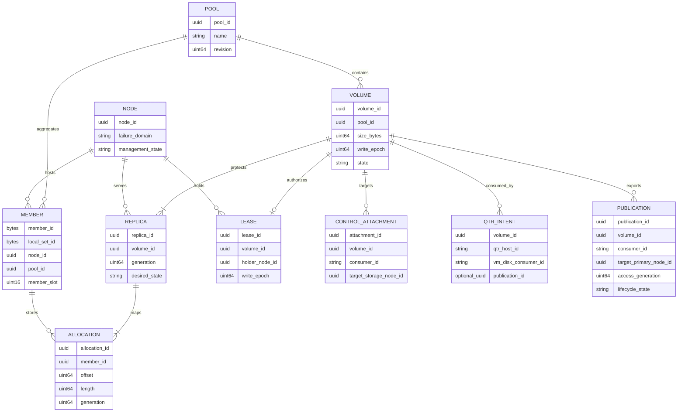
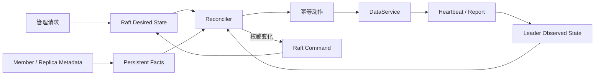
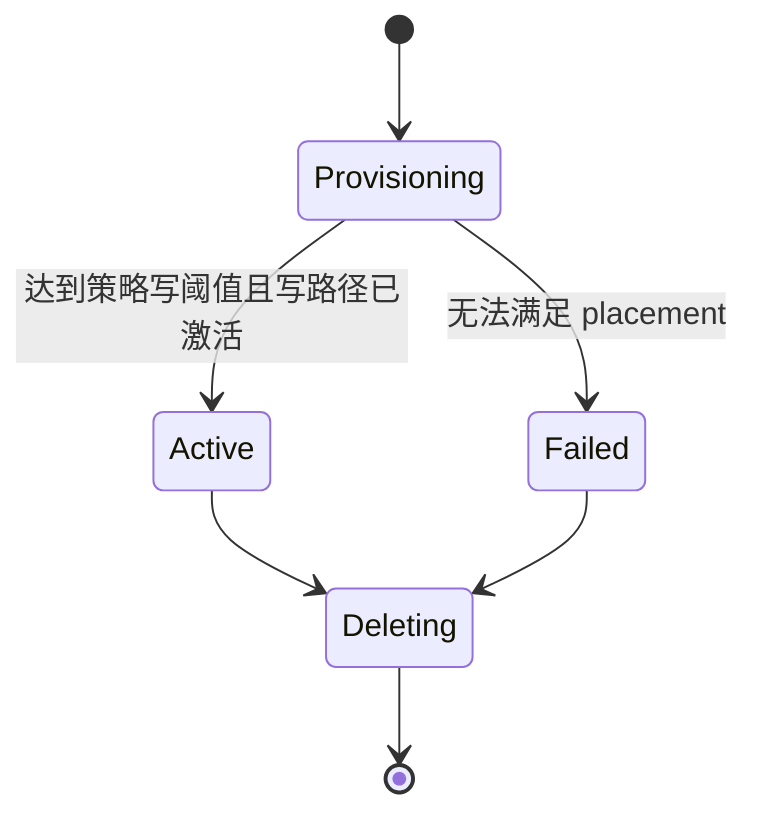

# 领域模型

> 状态：Pool、durable Volume metadata intent、NodeRegistration/MemberRegistration 与 leader-local NodeObservation 首个切片当前实现；其余为目标设计

## 模型边界

Tier 1 只使用本地容器或 raw Pool 格式。Tier 2 在本地 Pool 上增加 catalog Volume、protection policy 和 publication。Tier 3 由 `zettide-control` 管理集群级元数据，但不承载数据块；权威状态通过 Raft 复制，查询视图保存在内存，并由 WAL 和 snapshot 恢复。

Tier 3 控制面 Pool 是跨节点资源域。一个 Pool 包含多个 Volume；一个 Node 可以为一个或多个 Pool 提供本地 Member 容量；需要多副本保护的 Tier 3 Volume 将 Replica 分布到多个 Node 故障域。Tier 2 Replica 则位于同一 storage node 的不同 Member 上。

## 核心实体

| 实体 | 关键职责 | 持久位置 |
| --- | --- | --- |
| Pool | Volume 命名空间、Member 容量和默认保护策略 | 本地 catalog；Tier 3 进入 Raft 状态机 |
| Volume | 容量、可选保护覆盖、生命周期、write epoch | 本地 catalog；Tier 3 进入 Raft 状态机 |
| NodeRegistration | 节点身份、控制/NVMf endpoint、能力、故障域 | Raft 状态机 |
| MemberRegistration | 本地持久单元与控制面 Pool/Node 的绑定 | Raft 状态机 |
| ReplicaPlacement | Volume Replica 的目标 Node、角色和 generation | Raft 状态机 |
| ReplicaAllocation | Replica 在 Member 上不重叠的 extent/range | Raft 状态机 + Node 本地 catalog |
| VolumeLease | 当前 primary holder、lease ID、epoch 和授权边界 | Raft 状态机 |
| NodeObservation | incarnation、heartbeat、容量和运行状态 | 当前 leader 内存 |
| ReplicaObservation | 实际 generation、applied/committed position、健康和修复进度 | 当前 leader 内存 |
| ReconciliationAction | desired/observed 差异产生的幂等动作 | 派生任务；结果按需提交 Raft |
| VolumeAttachment | 当前占位 schema：Volume consumer 到目标 storage Node 的绑定 | Tier 3 Raft schema；mutation 尚未实现 |
| qtr AttachmentIntent | Volume、qtr host、VM/disk consumer、publication 和期望 access mode | qtr 持久状态；目标设计 |
| Publication | VM-facing target、consumer、access generation 和 lifecycle | Tier 2 本地 catalog；Tier 3 Raft 权威状态 + DataService installed state |

## 实体关系

## 容量与保护策略

- Pool Member topology 描述容量、稳定 Member 身份、状态和故障边界。
- Pool default protection 是新 Volume 未显式覆盖时采用的目标策略。
- Volume protection override 允许同一 Pool 中同时存在单副本和多副本 Volume。
- `desired_replica_count`、`current_replica_count` 和迁移 phase 分别表达目标、已达成保护和正在执行的操作。
- 新 Member 先以 joining 状态加入容量拓扑。它不会自动修改已有 Volume 的 protection policy。
- 扩容可以只发布新的可分配 extent，也可以由 reconciler 为选定 Volume 建立新 Replica、追平数据、验证后提升 current protection。
- 降低副本数先改变 desired state，再安全撤销多余 Replica；不能先删数据再修改策略。

当前格式和控制协议只固定表达部分上述字段。Pool default、Volume override、在线策略迁移和产品 API 均为目标设计。

qtr 在 Publish 前持久化的 AttachmentIntent 以 operation ID 作为恢复键，`publication_id` 初始为空。Publish 成功后，qtr 在 login 前原子补全 publication ID、access generation 和预期 SCSI serial/WWID；崩溃恢复使用同一 operation ID 查询未知结果。

## Desired、Observed 与 Persistent Facts

- Desired state 回答“系统应该是什么”。
- Observed state 回答“当前 leader 最近观察到什么”。
- Persistent facts 回答“节点重启后仍能从介质证明什么”。

Heartbeat 丢失可以将 Node 标记为 suspected，但不能直接删除 registration、提升 primary 或宣告数据丢失。任何写入权威变更必须形成 Raft command。

## 核心不变量

1. Pool、Volume、Node、Member 和 Replica ID 在各自作用域内唯一且不复用。
2. 一个 Volume 属于且只属于一个 Pool。
3. 一个 Replica 属于且只属于一个 Volume，并绑定一个 Node；其 allocation 映射到一个或多个不重叠 Member extent。
4. Tier 2 的多个 Replica 使用不同本地 Member；Tier 3 的多个 Replica 使用不同 Node 故障域。
5. 每个 protection policy 明确目标副本数、读取阈值和持久写阈值；Tier 3 默认策略是三个目标 Replica、2/3 写 quorum。
6. Tier 3 primary 必须是当前 placement 中的合格 Replica，并只能使用满足该 Volume protection policy 的 quorum。
7. 一个 Tier 3 可写 Volume 至多有一个有效 primary lease。
8. Tier 3 Volume write epoch 单调递增，不回退、不复用。
9. Tier 3 中任何可能使旧 primary 与新 primary 并存的操作必须推进 epoch。
10. Replica generation 在重建后变化；旧 generation 的 endpoint 不得重新加入当前 placement。
11. Observed state 不能覆盖 desired state 或介质上的持久事实。
12. 修复中的 Replica 不参与 current protection、写 quorum 或 primary 候选集合。
13. Placement 变更先建立新保护，再撤销仍承担 quorum 的旧 Replica。
14. Raft apply 必须确定、原子且无外部副作用。ID、时间和 placement 结果在 proposal 前确定。
15. 变更请求具有稳定 request ID；同 ID 不同语义必须返回冲突。
16. Pool 增加 Member 不隐式改变任何已有 Volume 的 protection policy。
17. `current_replica_count` 只能在新 Replica 完成数据验证并成为合格成员后提高。
18. qtr attachment 以稳定 Volume/consumer/host 身份恢复，不能以 `/dev/...` 路径作为权威。
19. Tier 3 publication access generation 由 Raft 权威状态单调推进；DataService 只安装等于当前 authority 且不低于本地最高 generation 的 publication。

## Volume 生命周期与保护状态

状态分为三个正交字段：

- `lifecycle_state`：Provisioning、Active、Deleting、Failed。
- `availability_state`：Healthy、Degraded、ReadOnly、Unavailable。
- `operation_phase`：None、Fencing、Recovering、Repairing。

Availability 按该 Volume 的 protection policy 参数化。`current_replica_count` 达到 desired protection 时是 Healthy；低于目标但仍满足持久写阈值时是 Degraded；只能满足读取阈值时是 ReadOnly。单副本策略在一个合格 Replica 就绪时可以是 `Active + Healthy`；默认三副本策略修复第三个副本时可以是 `Active + Degraded + Repairing`。对外展示按 Unavailable、ReadOnly、Degraded、Healthy 的优先级呈现，并单独附带 operation phase。

## 当前实现与差距

当前 `zettide-control` 实现 Pool、durable Volume metadata intent，以及 create-only 的 durable NodeRegistration 和 MemberRegistration。CreateVolume 保存 Pool 归属、逻辑容量、固定 3/2/1 保护参数、`Provisioning + Unknown + None` 状态、初始 generation/write epoch、创建 revision 和 resource version，但不选择 placement、不预留 extent，也不等待数据面 READY。GetVolume 经过 ReadIndex；DeleteVolume 要求 expected resource version，仅允许无 Replica/Attachment 引用的 Volume，并原子保留永久有界 tombstone。删除后名称可复用，Volume ID 不复用。

控制协议和 v5 状态快照已定义 ReplicaPlacement、ReplicaAllocation 与 VolumeAttachment durable schema。恢复会验证故障域、Pool/Node/Member 引用、extent 对齐与不重叠，以及 consumer 唯一性；当前尚无创建或演进这些 child resource 的 command。现有 VolumeAttachment 的 `target_node_id` 引用 storage NodeRegistration，缺少 qtr host 和 publication identity，因此只是 storage-side 占位 schema，不代表 managed qtr attachment 已定义或接通。

NodeRegistration 保存稳定 Node ID、cluster binding、control/NVMf endpoint、failure domain、capability bits、protocol version、注册时间和 revision；不保存 heartbeat、容量或在线状态。

MemberRegistration 使用介质原生 16-byte Member ID，绑定控制面 Pool、hosting Node 与 16-byte local set ID，并保存稳定 slot、birth topology digest、metadata/data capacity 和 extent size。Member ID 全局唯一；一个 local set 只绑定一个控制面 Pool；同一 local set 的 slot 不可冲突。设备路径、当前 topology/authority、使用量和健康不进入 registration。

状态机使用 Pool/Node/Member/Volume 共享 request history、v5 快照与恢复，并兼容读取 v2 Pool-only、v3 Pool/Node 和 v4 Pool/Node/Member 快照。当前 NodeObservation 只包含 Node incarnation/sequence、接受时间、leader term、Member presence 和可选 extent capacity；相同 ordering tuple 的相同语义可重放，不同语义或回退会冲突。Observation 只存在于当前 leader 内存，5 秒后 stale，leader 切换或恢复 snapshot 时清空，不覆盖 registration，也不进入 WAL/snapshot。

Volume placement 和 lifecycle 收敛、Replica/Allocation/Attachment mutation、lease、epoch enforcement、路径健康、Replica positions 和 repair progress 尚无实现；Node 更新、隔离和注销以及 Member lifecycle 也尚未实现。当前 `zettide` 已有 multi-Volume catalog codecs/graph/store、extent mapping、catalog data lease、writable Volume backend 和 endpoint registry 的库级实现，但尚无完整产品 CLI、动态容量发布、保护策略迁移或 qtr publication lifecycle。`zettide-control` 的 Volume protection 仍固定为 3/2/1 metadata intent；Pool default 和 per-Volume override 尚未进入协议。
