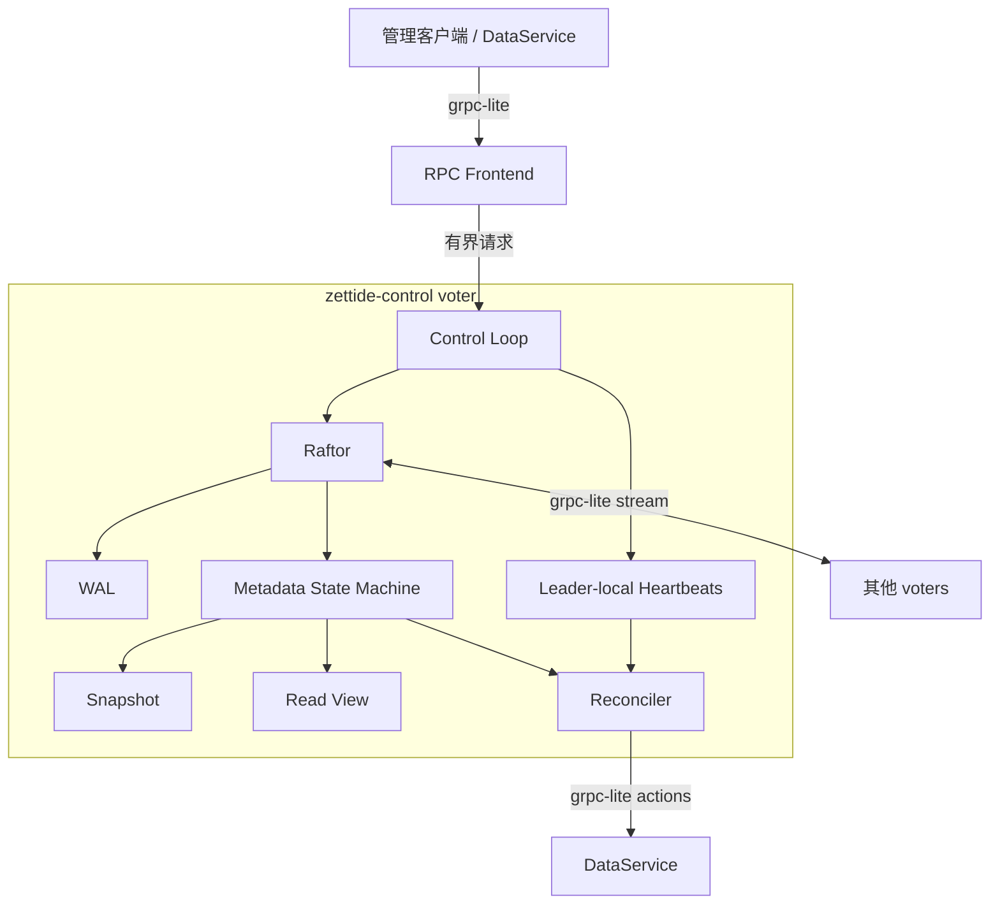
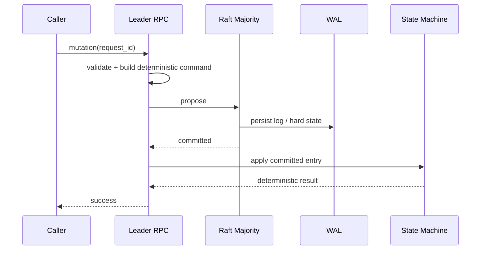

# 控制面

> 状态：基础库和 Pool 状态机当前存在；服务装配与集群级模型为目标设计

## 总体结构

`zettide-control` 采用单个 Raft group 复制集群元数据。每个 voter 按相同顺序 apply committed log prefix，但 applied index 可以暂时不同；WAL 保存 Raft 持久状态和日志，snapshot 保存应用状态镜像。

WAL 和 snapshot 是恢复介质，不是独立查询数据库。正常查询读取已经 apply 的内存状态。

## API 分组

| API 组 | 职责 | 状态 |
| --- | --- | --- |
| Pool | 创建、查询和枚举 Pool | protobuf 已定义；handler 未实现 |
| Volume | 生命周期、容量和保护策略 | 目标 |
| Node | 持久注册、能力更新、隔离和注销 | 目标 |
| Heartbeat | incarnation、容量、Replica 和路径观测 | 目标；leader-local |
| Placement | Replica 目标、generation 和迁移状态 | 目标 |
| Lease | Primary 授权、续期、撤销和 epoch | 目标 |
| Reconciliation | 下发幂等动作、报告结果与错误 | 目标 |

这些是职责边界，不预先固定具体 RPC 名称。接口落地时使用版本化 protobuf，并保持管理 API 与节点内部 API 分离。

## 元数据写入

成功响应必须来自 committed entry 的 apply 结果。Proposal 入队、leader 本地 append 或 grpc-lite 发送成功都不能提前确认。

ID、时间、随机数和 placement 选择必须由 leader 在 proposal 前生成并写入 command，所有 voter 对相同 command 执行相同 apply。

状态机 apply/restore 必须原子。`raft-zig` 将 apply error 视为 terminal，因此业务冲突应编码为确定性结果，而不是破坏 Raftor 的运行错误。

## 幂等

grpc-lite 不自动重试，但调用者遇到 deadline 或连接失败时无法判断请求是否已经提交。所有变更请求需要：

- 稳定 request ID。
- 覆盖语义参数的 fingerprint。
- 状态机保存的最终 apply response。
- 相同 ID、相同 fingerprint 返回原结果。
- 相同 ID、不同 fingerprint 返回 request conflict。

当前 Pool 状态机已经实现这一模式，后续 Volume、Node 和 lease command 应沿用同一原则。

## 线性一致读取

默认权威读取使用 `raft-zig` ReadIndex：

1. 请求由当前 leader 接受。
2. Leader 完成当前任期的 quorum read barrier。
3. 本地 applied index 达到 read index。
4. 从内存状态返回结果和 revision。

Follower 不直接把本地状态描述为线性一致结果。若未来提供 stale read，必须作为显式一致性选项，并返回 applied revision。

## Leader 职责

目标设计中，当前任期 leader 独占：

- 接受权威写入和协调 ReadIndex。
- 接收 Node heartbeat 并维护 observed state。
- 运行 placement、repair 和 lease reconciliation。
- 提议 primary、epoch 和权威状态变化。

Leader 退位时立即停止新的调度和 lease 决策。旧 leader 的 heartbeat 视图不进入 snapshot。新 leader 从 durable desired state 恢复，并在收到新 heartbeat 前将节点活性视为 unknown。

## 注册与 Heartbeat

NodeRegistration 经 Raft 持久化，包含：

- stable node ID 和 cluster ID。
- control endpoint 与 NVMf endpoint。
- failure domain。
- 本地能力、介质类别和 RDMA/iWARP 能力。
- 软件/格式兼容信息和管理状态。

Heartbeat 只保存在 leader 内存，包含 incarnation、容量、路径健康、Replica positions、lease 观测和 repair progress。地址或能力的权威变化不能由 heartbeat 静默覆盖 registration。

这种分离避免高频 heartbeat 放大 Raft 日志。Leader 切换后 DataService 必须重新上报。

## Reconciliation

Reconciler 不直接修改状态机，而是执行以下循环：

1. 对一个一致 revision 读取 desired state。
2. 合并当前 observed state 和介质持久事实。
3. 生成带 resource ID、generation 和 expected revision 的幂等动作。
4. 通过 grpc-lite 下发到 DataService。
5. 接收执行结果并验证前置条件仍成立。
6. 需要改变权威状态时提交新的 Raft command。

同一 Volume 的所有权变更必须串行化。慢节点或长时间 repair 不得阻塞 Raft apply。

## 线程与背压

- grpc-lite callback 只解码、基础校验和有界入队，不执行阻塞 WAL 或介质操作。
- Raftor event loop 由单一 driver 驱动，不并发重入。
- State machine apply 按日志顺序串行。
- Proposal、ReadIndex、heartbeat 和 action queue 都设置数量/字节上限。
- Heartbeat 可以覆盖同节点的旧样本，不能无限排队。
- 队列饱和返回明确 overload，不使用无界内存维持假可用。
- Deadline 在排队和执行阶段传播；handler 超时不能被误认为命令未提交。

## 恢复

控制节点启动顺序：

1. 读取稳定 cluster/node identity。
2. 打开 WAL；有既有状态时必须按 restart 处理，不能重新 bootstrap。
3. 加载最新有效 snapshot。
4. 原子恢复状态机并重放后续 WAL。
5. 追平 committed/applied index 后才提供一致性服务。
6. 作为 follower 加入 Raft；成为 leader 后重新收集 heartbeat。

生产配置必须使用持久 `data_dir`。快照保存 durable metadata 和业务幂等记录，不保存 socket、heartbeat 或临时 action。

## 当前差距

- 没有控制面 executable、配置、grpc-lite server 或 Pool handlers。
- PoolStateMachine 尚未装配 Raftor、WAL 和 grpc-lite transport。
- Volume、Node、Replica、placement 和 lease command 尚未定义。
- 没有 leader-local heartbeat store 和 reconciler。
- 没有 restart、leader failover 和端到端 ReadIndex 集成测试。
