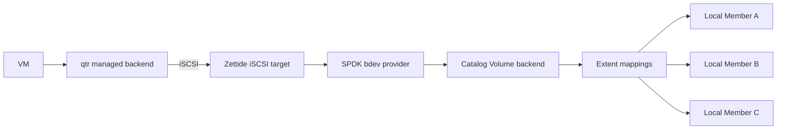
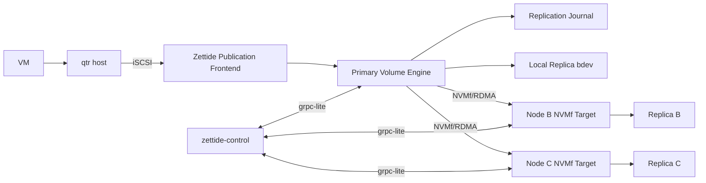

# 数据面

> 状态：Tier 1 当前存在；Tier 2 具备 catalog/SPDK/vhost 库级基础；iSCSI 与 Tier 3 分布式路径为目标设计

## Tier 1：本地文件系统

当前 Linux 前端是 foreground FUSE + littlefs。Backend 可以是 sparse container file，或显式选择的 raw Pool。产品 CLI 对 raw Pool 只支持一个无保护设备或三个复制设备；Tier 1 不提供网络文件服务。

## Tier 2：单节点 VM block service



当前 catalog Volume backend、异步 bdev provider 和 vhost-user-blk export 已有库级生命周期。目标首个产品出口是 iSCSI：DataService 创建绑定 publication identity/access generation 的 target/LUN，qtr 管理 host login 与 libvirt attachment。IQN/LUN 可以在重启后保持稳定以降低路径抖动，但 Volume ID、publication ID 和稳定 SCSI serial/WWID 才是身份校验依据。vhost-user-blk 保留为可选后续 frontend，不改变 Volume identity 或 protection semantics。

Tier 2 的 Member 数量与 Volume 副本数相互独立。Pool default protection 与 per-Volume override 产生 desired placement；reconciler 通过复制、校验和原子 publication 新 layout 推进 current protection。迁移中断后从持久 generation、mapping 和 progress 恢复，不能把仅有目标记录的 Replica 计入保护级别。

单节点的多 Replica 只能抵抗相应设备故障。Storage process 或整机故障会使 Tier 2 publication 不可用。

## Tier 3：分布式目标结构

VM 经 qtr host 和 Zettide iSCSI publication 访问 Volume。默认 protection policy 使用三个 Replica 和 2/3 写 quorum；更低保护的 override 只能获得对应 current protection 能证明的故障保证。Primary 直接访问本地 Replica，并通过 SPDK NVMf 访问远程 Replica。



控制面决定“Replica 在哪里、谁是 primary、哪个 epoch 可写”；数据面决定“字节如何排序、复制和持久确认”。

## VM-facing 前端

Tier 1 当前 Linux 前端是 FUSE + littlefs。Tier 2/3 面向 qtr 的首个 block frontend 是标准 iSCSI publication。FUSE 可以继续作为本地文件系统 frontend；vhost-user-blk 是已具备库级原语的可选 VM frontend。

在 Tier 3 中，iSCSI target 不是写入权威，所有写入仍由当前 Volume primary 协调。首版将 publication 与 primary 共置，避免增加一条尚未设计的 frontend-to-primary forwarding protocol；qtr host 可以位于其他主机。Primary 切换时在新 primary 激活更高 access generation 的 publication，再由指定 qtr host 重建 session/attachment。未来若允许 publication 与 primary 分离，必须先冻结并验证独立的 forwarding protocol，不能隐式复用 Replica NVMf transport。

## Replica 与 Namespace

每个 Replica 具有：

- Stable Replica ID、Volume ID 和 Node ID，以及一个或多个带 generation 的 ReplicaAllocation。
- Replica generation。
- NVMf subsystem/NQN、namespace ID 和 transport endpoint。
- `max_accepted_epoch`。
- applied position、committed position 和 dirty ranges。
- Healthy、Degraded、Rebuilding、Offline 或 Stale 状态。

Replica 作为内部 NVMf namespace 导出。Namespace 生命周期由 DataService 管理，不能由外部客户端自行创建。Replica 的数据区映射为 namespace LBA；journal、epoch 和 commit certificate 位于 target 私有元数据区，不能由 initiator 作为普通 LBA 覆盖。

标准 NVMe 写命令没有 Zettide write epoch、sequence 和 checksum 字段。内部 Replica 协议因此采用 SPDK target 扩展处理的 vendor-specific NVMe commands，通过 NVMf 同时传输数据和复制元数据。Target 将这些命令转换为不可绕过的 Replica state-machine 操作；普通 block write 不具备 Replica 写权限。

目标实现还需要 epoch-bound session gate：

1. 将 namespace 置为 quiescing，拒绝旧 session 的新写入。
2. 撤销旧身份并断开旧 controller/qpair。
3. 等待已经接收的旧 I/O drain，并 flush 到持久介质。
4. 持久化新的 `max_accepted_epoch`。
5. 只为匹配 `(volume, replica generation, primary node, epoch)` 的新 session 开放写权限。

具体 vendor command、session context、元数据布局和 SPDK request handler 必须在实现 ADR 中冻结。动态 ACL 或 Host NQN 单独都不是充分 fencing；在可信网络首版中它们只约束非恶意受管节点，不构成对伪造身份的安全防护。

## 写入协议

默认三个 Replica，写 quorum 为两个。Primary 通常优先使用本地 Replica，但任意两个当前合格 Replica 都可以组成 quorum。

每个写入至少具有：

```text
volume_id
replica_generation
write_epoch
write_sequence
range
payload_checksum
```

Primary 使用两阶段持久协议：

1. 检查本地 lease 仍在安全窗口。
2. 在当前 epoch 内分配单调 write sequence。
3. 向 Replica 发送 `PREPARE` vendor command，其中包含协议字段和 payload。
4. Replica 校验 session epoch/generation，将数据与 prepare record 持久化，并返回 prepare digest。
5. 收集至少两个 durable prepare attestations，形成列出具体 Replica 和 digest 的 quorum commit certificate。
6. 只向已持有匹配 prepare/payload 的 Replica 发送 `COMMIT` candidate。
7. 同一 certificate 持久化到两个 Replica 后形成 quorum commit，更新 committed position 并向前端确认。

进入内存、NVMf 发送队列或设备易失缓存不算 durable ack。Replica admission 必须检查 bdev 是否真正支持所选 Flush/FUA 语义、volatile write cache 的处理方式和断电保护；不满足持久性能力的设备不能计入 quorum。SPDK 对不支持 Flush 的 bdev 可能返回成功，因此不能只依据 completion 推断持久性。

每个 certificate holder 必须同时持有其证明的 prepare/payload。Certificate 写入两个 Replica 后才是已提交并允许返回 success。任意两个 Replica 构成 recovery quorum，成功写 quorum 必然与其相交；恢复中观察到的单份 certificate candidate 必须先 write-back 到第二个 Replica，再纳入 committed history。Recovery quorum 完全看不到的孤立 candidate 从未满足客户端成功条件，由更高 epoch recovery frontier 淘汰。

首版每个 Volume 同时只允许一个 unresolved sequence。Sequence N 没有被 recovery quorum 观察到 certificate 时可以在发布更高 epoch frontier 后确定性丢弃；观察到 candidate 时必须补齐第二份 certificate。后续只有在引入显式 commit frontier 和 quorum ABORT record 后才能流水化多个未决 sequence。

## 读取

正常读取由 primary 选择属于当前 generation 且 applied position 不落后于所需 committed position 的 Replica：

- 优先本地 Replica。
- 本地失败时通过 NVMf 读取健康远程 Replica。
- 不从 Rebuilding、Stale 或落后 Replica 返回权威数据。
- 校验失败时切换读取源并标记故障范围。

正常读不要求同时读取两个 Replica，但切换后的数据源必须能够证明已追平权威提交边界。

## NVMf 不是复制协议

NVMf 只提供远程块访问，不能回答：

- 哪些写入已获得 2/3 持久确认。
- 断线 Replica 应用到了哪个位置。
- 重试写入是否与原写入相同。
- Primary 故障后哪个尾部是已提交状态。
- 落后 Replica 需要同步哪些范围。

因此 Zettide 需要自定义 Replica protocol 和 target-owned metadata：

- replication journal：epoch、sequence、range、checksum 和提交状态。
- per-Replica applied position。
- quorum committed position。
- dirty ranges 或变更位图。
- 增量追赶；journal 不足时执行范围或全量 rebuild。
- commit evidence 和数据完整性摘要。
- `PREPARE`/`COMMIT` vendor commands 及其崩溃窗口恢复规则。
- 不可由普通 namespace write 修改的 epoch 和 certificate 区域。

当前 v3 control journal 管理 Pool 成员和 topology，不是 Volume 数据复制日志，不能直接替代上述机制。

同样，iSCSI 只是 VM-facing block transport。它不决定 Replica placement、提交 quorum、write epoch 或 storage failover，也不能替代内部 Replica protocol。

## 当前本地路径

当前 `zettide`：

- 使用文件或 Linux block fd 执行 positional I/O。
- 支持一个本地 Member 或三个本地 Member。
- 三副本写循环写入全部 ReplicaEndpoint；任一 write/sync 失败冻结 writer。
- 三副本读寻找至少两个 byte-identical 结果。
- Writable reopen 完整比较副本数据，不自动修复。
- multi-Volume catalog、extent mapping、catalog data lease 和 writable backend 已有库级实现。
- managed SPDK runtime、bdev dispatcher、NVMe-oF initiator、异步 provider 和 vhost-user-blk controller 已有 focused tests。

这些能力提供格式、错误处理、本地复制和 block export 基础，但尚无产品 daemon、iSCSI lifecycle、qtr attachment、在线保护迁移、2/3 数据提交、跨节点 fencing、resync 或 NVMf target。
