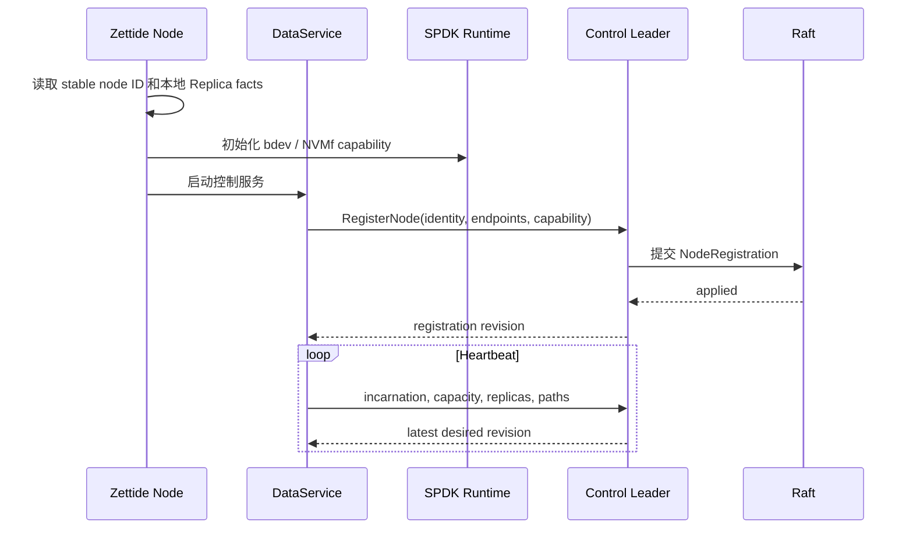
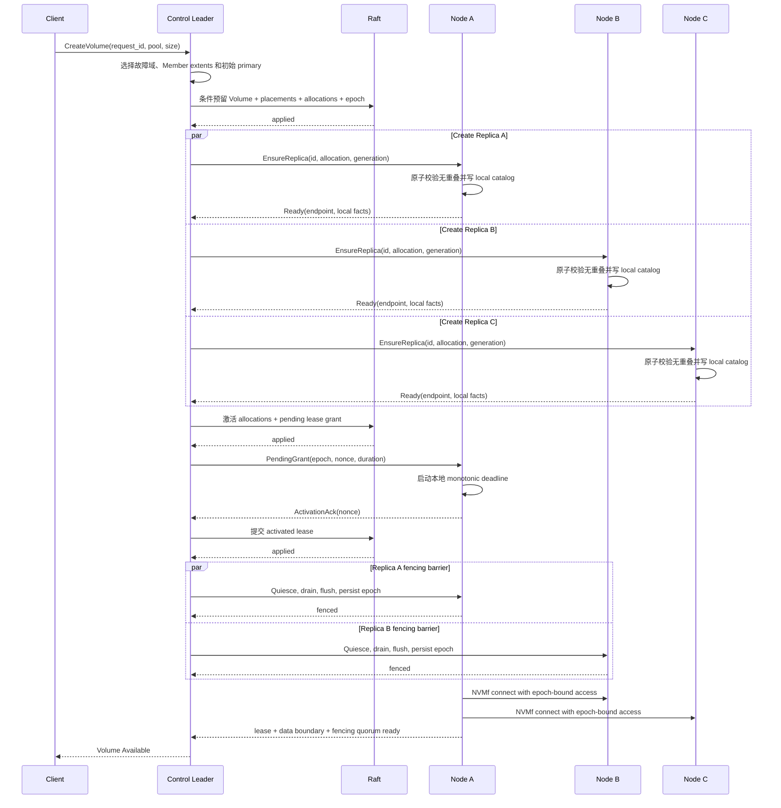
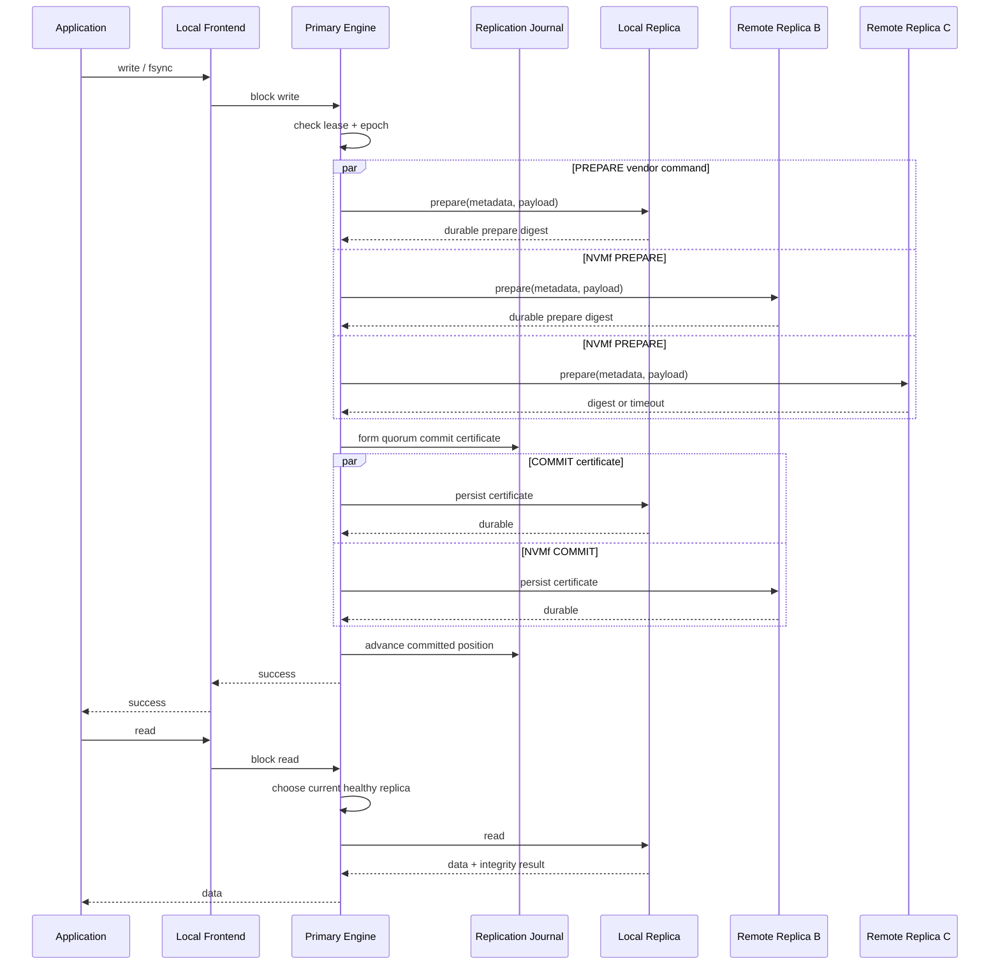
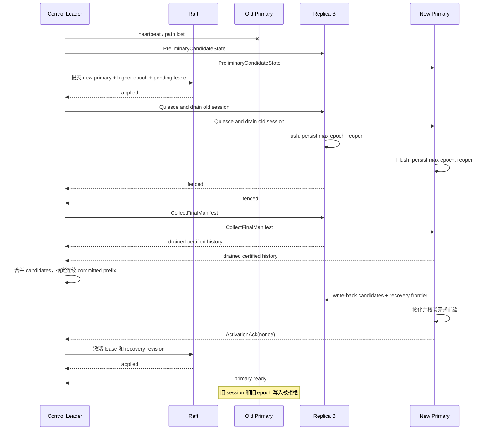

# I/O 与控制流程

> 状态：目标流程

## 通信边界

| 流量 | 协议 |
| --- | --- |
| Replica vendor commands、数据读写和重同步 | SPDK NVMf/RDMA（IB、RoCE 或 iWARP） |
| Node 注册、heartbeat 和状态报告 | grpc-lite |
| Volume/Replica 创建和删除 | grpc-lite |
| Primary、lease、epoch 与 fencing 协调 | grpc-lite |
| NVMf endpoint/namespace 发现 | grpc-lite |
| 控制节点间 Raft 消息 | raft-zig over grpc-lite |

## 节点注册

Registration 持久化，heartbeat 易失。Leader 切换后 Node 无需创建新身份，但必须向新 leader 重新 heartbeat。

## 创建 Volume

Allocation reservation 包含 allocation ID、Member ID、offset、length 和 generation，并通过 Raft 条件事务防止控制面重叠。Node local catalog 是第二道持久校验，发现冲突时拒绝而不自行改选范围。部分创建失败时 reservation 保留，由 reconciler 重试或显式 tombstone 后重新放置。

`EnsureReplica` 以 Replica/allocation ID 和 generation 幂等。删除时先撤销 namespace/session，再写 generation tombstone 并进入 quarantine；只有控制面确认旧 generation 不再可达、Node catalog 已持久更新后，extent 才能重新分配。

## 写入和读取

第三个 Replica 未确认时对应范围进入 dirty set，后台 resync 不改变已确认写入的可见性。

## Primary 故障切换

仅 heartbeat 存活不足以成为 primary。Fencing quorum 必须先阻止旧 epoch 新写入并 drain 已接收 I/O，然后才能收集最终 manifest。控制面从该 recovery quorum 的 certificates 恢复并集、write-back 单份 candidate、持久化新 frontier；候选物化完整连续前缀并激活 lease 后才能开放写入。

## Replica 恢复

1. 恢复节点校验 Volume ID、Replica ID、generation 和 epoch。
2. 旧副本标记为 Stale/Rebuilding，不参与读、写 quorum 或 failover。
3. Primary 比较 journal position、dirty ranges 和数据摘要。
4. Journal 覆盖时增量追赶，否则执行范围或全量 rebuild。
5. 对追赶结果执行 checksum/summary 验证。
6. 追平当前 committed position 后，上报 Ready。
7. Reconciler 提交其合格状态，恢复三副本保护。
