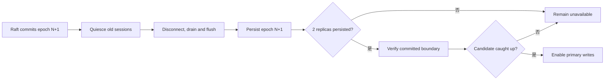

# 一致性与 Fencing

> 状态：Tier 2 attachment 与 Tier 3 fencing 为目标设计；Raft 和本地故障冻结基础当前存在

本章详细协议按 Tier 3 默认 3/2 protection profile 描述。其他 override 必须用同一安全结构和自身 read/write/fencing thresholds 完成独立验证；数据面尚未支持的 profile 不能进入 Active。Tier 2 单节点保护迁移只复用 desired/current 分离，不自动获得本章的跨节点 quorum 保证。

## 一致性分层

| 对象 | 权威来源 | 保证 |
| --- | --- | --- |
| Pool、Volume、Node、placement、primary、epoch | Raft 状态机 | 线性一致 |
| Node registration | Raft 状态机 | 线性一致、跨 leader 持久 |
| Heartbeat 和路径健康 | 当前 leader 内存 | 临时观测、最终收敛 |
| Tier 2 protection migration | 本地持久 catalog + reconciler | desired/current 分离、崩溃后继续收敛 |
| qtr attachment | 持久 attachment intent + provider/session/libvirt observation | 幂等收敛，不以设备路径作为权威 |
| Tier 3 Volume 写入 | Primary + Replica quorum | 单主；默认 3 副本、2/3 持久确认，实际保证受 current protection 限制 |
| Replica 健康和 repair progress | 数据面上报 | 最终收敛，不单独授予权限 |

Raft 对元数据命令排序，不自动保证数据块一致。数据面必须有独立的写入顺序、提交证据和修复协议。

## 元数据线性一致性

以下操作都通过 Raft 提交：

- 创建、修改和删除 Pool/Volume。
- 注册、隔离和注销 Node。
- 修改 placement 和 Replica generation。
- 分配或撤销 primary。
- 增加 Volume write epoch。
- 授予和续期 lease。
- 将完成修复的 Replica 重新标为合格。

写入只有在状态机 apply 后成功。权威读取通过 ReadIndex 等待本地 applied index。客户端重试使用稳定 request ID，避免未知结果造成重复变更。

## Lease 与 Epoch

有效写授权至少包含：

```text
volume_id
primary_node_id
lease_id
write_epoch
placement_revision
grant_revision
activation_nonce
lease_duration
```

- Lease 限制写权限的时间窗口。
- Epoch 永久隔离历史 primary。
- Lease 续期必须由有 Raft quorum 的 leader 提议并提交。
- Primary 变化或可能存在旧 writer 时必须增加 epoch。
- Raft 首先提交 pending grant；该状态本身不能写入。
- Holder 只在当前 grpc-lite stream/incarnation 上接受最新 grant，发送一次性 activation nonce 的 ACK，并从发送 ACK 前开始本地单调计时。
- Leader 验证 nonce、holder、epoch 和 grant revision 仍为当前值后，再通过 Raft 提交 activated state。
- Holder 观察到 activated state 后才写入，但 deadline 已从 ACK 前开始；延迟消息只会缩短可用窗口，不会重新获得完整 duration。
- Lease 不依赖不同主机的 monotonic clock 可比较，也不把 wall-clock `expires_at` 作为唯一安全依据。
- 时钟误差、进程暂停、续期窗口和提前停止余量属于部署策略，在实现前必须形成可测试预算。
- 未激活或过期 grant 不可重放；leader 切换后未完成 activation 的 grant 必须重新协调。
- 新 primary 的最终互斥性由 Replica fencing quorum 保证；控制面不以“等待旧 lease 到期”替代 fencing。Lease 主要限制旧 primary 自主运行的时间。

控制面失去多数派时不授予、不续期 lease，也不切换 primary。现有 primary 只能在已经获得的安全窗口内继续；到期后停止写入。

## Fencing Barrier

新 primary 不能只因为 Raft 已提交新字段就立即写入：

1. Raft 提交 new primary、higher epoch 和 lease。
2. 至少两个 Replica 进入 quiescing，拒绝旧 session 的新写入。
3. Replica 撤销旧身份、断开旧 controller/qpair，并等待已经接收的 I/O drain。
4. Replica flush 旧 I/O 后持久化 `max_accepted_epoch`。
5. Replica 为新 epoch session 重新开放写权限；至少两个确认后形成 fencing quorum。
6. 候选合并 certified history，物化并验证完整 committed prefix。
7. Lease、fencing quorum 和数据边界都有效后才进入可写状态。



Replica 永久拒绝低于 `max_accepted_epoch` 的访问。旧 primary 即使还能访问一个尚未更新的 Replica，也无法取得 2/3 提交。

## NVMf Enforcement

标准 NVMe command 不携带 Zettide epoch 或 sequence。内部 Replica 写入使用 vendor-specific NVMe commands，由自定义 SPDK target request layer 校验协议字段，并把 journal/epoch/certificate 保存在 initiator 无法作为普通 LBA 修改的 target-owned metadata 中。Epoch enforcement 同时发生在 session/namespace 准入和 Replica 持久元数据边界：

- 写 session 绑定 primary Node、Volume、Replica generation 和 epoch。
- 安装新 epoch 前 quiesce、断开并 drain 旧 qpair，避免旧在途 I/O 晚于 epoch marker 落盘。
- Replica 重启先恢复 `max_accepted_epoch`，再开放 namespace。
- Transport 重连不清除 epoch，也不自动恢复写权限。
- 外部客户端不能绕过 Volume Engine 直接取得 Replica 写权限。

具体 vendor commands、SPDK request handler 和 session identity 是实现前必须完成的 ADR。首版 trusted-network 模型假设节点非恶意；裸 Host NQN/ACL 不可作为不可伪造认证。若未来将 session identity 纳入安全边界，需要 DH-HMAC-CHAP 或等价的可轮换凭据。

## iSCSI Publication 与 Attachment

iSCSI session 只授权 qtr host 访问 VM-facing publication，不授予一个 storage node 成为 Volume primary 的权力。普通 iSCSI command 不携带 Zettide Volume write epoch，Replica epoch gate 无法区分连接到同一 primary 的新旧 qtr initiator，因此 publication 具有独立、单调的 access generation。

Tier 2 DataService 在本地 catalog 持久化 access generation。Tier 3 则由 Raft 保存 publication identity、target primary、access generation、access mode 和 lifecycle；每个 DataService 另行持久化本机最高 installed generation。Target 将当前 generation 绑定到 session context、ACL/credential 和期望 access mode。

同一 primary 上转移 exclusive writer 时，先 quiesce 旧 session、停止接收新 I/O、drain/flush 已接收请求并撤销旧 ACL/credential，再安装更高 generation。Primary/storage node 失联时无法证明旧 iSCSI session 已 drain；控制面必须等待旧 primary lease 安全退出，并通过 Replica quorum 安装更高 Volume epoch。Raft 随后提交更高 publication generation 和新 target，新 primary 只在 authority、lease、Volume epoch 和 installed generation 全部匹配后开放 I/O。旧 session 即使仍存在也无法在旧 primary 上形成 quorum commit。

Publication path 故障不必然改变 Volume primary 或 write epoch；primary failover 与 publication fencing 是两个可独立发生但在 storage-node loss 中组合执行的 barrier。

Attachment 状态转换遵守以下顺序：

- Attach：先持久化 qtr attachment intent，再建立有效 publication、login 和验证设备身份，最后修改 libvirt attachment。
- Detach：先持久化 detaching intent并确认 libvirt 不再使用设备，再 logout，最后 unpublish。
- Republish：若 primary 同时失效，先完成 storage primary fencing 和 committed-boundary recovery；始终完成 publication access-generation fencing，再让指定 qtr host 建立新 session/attachment。
- 未知响应使用相同 request/publication identity 查询或重试，不能创建第二个可写出口。

## 数据提交

同一 epoch 内，primary 为写入分配单调 sequence。相同 `(epoch, sequence)` 的重试必须具有相同 range 和 checksum，否则拒绝为协议冲突。

数据提交使用两阶段 quorum protocol。客户端成功意味着：

1. 至少两个 Replica 已持久化相同 prepare/data record，并返回 prepare digest。
2. Primary 形成列出 quorum Replica 和 digest 的 commit certificate。
3. Certificate holder 必须同时持有匹配 prepare/payload；单份 certificate 只是待 recovery quorum 决议的 candidate。
4. 第二个 Replica 持久化同一 certificate 后形成 quorum commit，并满足客户端 success 条件。
5. 所有更早已确认写入仍保持顺序一致。

崩溃窗口的恢复结论：

- 少于两个 durable prepares：未提交。
- 已有 prepare quorum、但没有任何 durable certificate：未提交，恢复确定性丢弃。
- Recovery quorum 观察到一份 certificate candidate：未曾满足客户端 success，但恢复必须 write-back 到第二个 Replica 后纳入提交，客户端结果可能是 unknown。
- Certificate 已在两个 Replica 持久化：达到客户端 success 条件，即使 response 丢失也必须保留。
- Recovery quorum 完全看不到 certificate：该 write 未达到 success；更高 epoch frontier 发布后，隔离 Replica 上随后出现的旧 candidate 被视为 stale。

首版每个 Volume 同时只允许一个 unresolved sequence。Recovery quorum 没有观察到 certificate 时，可以在持久化更高 epoch recovery frontier 后丢弃 prepare；观察到 candidate 时必须先 write-back/物化该 sequence。后续流水线版本需要显式 commit frontier 和 quorum ABORT record。

任一单 Replica 丢失后，每个已向客户端确认的 write 仍有至少一份 certificate 和 payload。恢复从两个幸存 Replica 的 certified histories 取并集，按 `(epoch, sequence)` 验证连续性并把完整前缀物化到新 primary；不能要求某个幸存 Replica原先就单独拥有全部写入。

## Lease 到期和在途 I/O

- 到期后停止接受新写入。
- 已形成持久 quorum commit 的写入不回滚。
- 未形成 commit evidence 的 I/O 返回失败或 unknown，不在旧 lease 下继续重试。
- 续租结果未知时不能假设 lease 已延长。
- 读请求只在能够选择追平权威边界的 Replica 时继续，否则暂停。

## 不变量

- 同一 Volume 同一时刻最多一个可写 epoch。
- Raft 中的 Volume epoch 严格单调。
- Replica 的 `max_accepted_epoch` 永不回退。
- 低 epoch 写入不能进入高 epoch 提交历史。
- 新 primary 可写前完成 fencing quorum。
- 修复中的 Replica 不参与 quorum。
- 客户端成功表示 2/3 可验证持久提交。
- Heartbeat 不授予写权限。
- 控制面失去多数派后不产生新 lease。
- Exclusive publication 的 access generation 在 Raft authority 中单调递增；旧 target 可达时撤销并 drain，失联时必须先让旧 primary lease 到期并完成 Replica epoch fencing。

## 当前差距

当前已有 `raftz` 的共识/WAL/ReadIndex，以及 `zettide` 本地写失败冻结和控制记录扫描。尚未实现 managed iSCSI publication、qtr attachment reconciliation、Volume lease、write epoch、Replica 持久 fencing、2/3 数据提交证据和 epoch-bound NVMf access。
