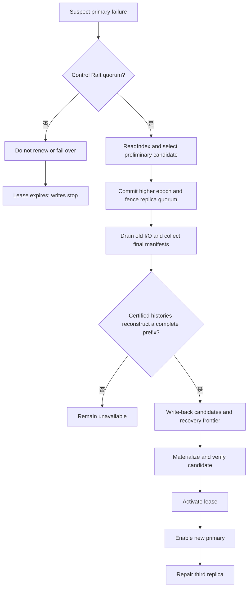

# 故障与恢复

> 状态：恢复原则为目标设计；本地格式和 Raft 库提供部分基础

## 恢复优先级

1. 不产生两个可写 primary。
2. 不丢失已经确认的写入。
3. 不把孤立或损坏数据错误提升为权威状态。
4. 在安全条件满足后恢复服务。
5. 最后恢复完整冗余和性能。

Heartbeat 丢失只是故障怀疑，不是转移写权限的充分条件。

## Volume 可用性与运行阶段

| Availability | 含义 | 可写 |
| --- | --- | --- |
| Healthy | 三个 Replica 合格，primary lease 有效 | 是 |
| Degraded | 两个合格 Replica，仍可形成 quorum | 是 |
| ReadOnly | 可确定权威数据，但不能安全形成写 quorum | 否 |
| Unavailable | 无法证明权威状态或形成必要 quorum | 否 |

| Operation Phase | 含义 | 与 Availability 的关系 |
| --- | --- | --- |
| None | 无控制操作 | 使用正常 availability |
| Fencing | 正在 quiesce 并安装新 epoch | Volume 暂时 Unavailable |
| Recovering | 正在合并 certified history 或追赶 primary | Volume 暂时 Unavailable |
| Repairing | 至少一个 Replica 正在重建 | 通常同时是 Degraded；另外两个合格 Replica 可以继续写 |

## 故障矩阵

| 故障 | 服务影响 | 安全行为 | 恢复条件 |
| --- | --- | --- | --- |
| 一个 secondary 失效 | 降级运行 | 从 quorum 候选移除，记录 dirty ranges | 恢复或重建第三 Replica |
| Primary 失效 | 暂停 I/O | 提交更高 epoch，并在 Replica quorum 强制 fencing | 控制 quorum、可恢复 certified history、fencing quorum |
| Primary 与控制面隔离 | Lease 窗口内有限运行 | 无法续租后提前停止写 | 恢复控制链路或安全切换 |
| Primary 只能访问一个 Replica | 写入停止 | 单副本 completion 不确认 | 恢复至少一个合格 Replica 路径 |
| 控制 follower 失效 | 通常无影响 | 剩余 Raft quorum 继续 | 节点重启追赶 |
| 控制面失去多数派 | 元数据不可变；lease 最终到期 | 不续租、不 failover | 恢复原集群多数派 |
| Leader 切换 | Heartbeat 视图清空 | 从 durable state 恢复，重新收集 heartbeat | 新 leader ReadIndex 和新观测完成 |
| Replica checksum 错误 | 降级或停止 | 隔离损坏 Replica | 从合格源重建并校验 |
| Replica 数据分歧 | 进入 Recovering/Unavailable | 不按时间戳猜测权威 | 合并幸存 certified histories 并验证连续前缀 |
| RDMA/qpair 中断 | 对应 I/O 暂停或降级 | 不把传输失败/未知 completion 当作 durable ack | 重连并比较 epoch、generation 和 position |
| 同时永久丢失两个 Replica | 超出保护范围 | 单幸存 Replica 不自动成为新权威 | 人工恢复或找回足够提交证据 |
| WAL 尾部撕裂 | 单控制节点恢复延迟 | 只截断可证明未完成尾部 | 从有效前缀和 snapshot 恢复 |
| WAL 中段/snapshot 损坏 | 单控制节点停止启动 | Fail closed，不跳过记录 | 从健康 voter 重新同步或受控加入 |

## Primary Failover

候选 primary 必须：

- 属于当前 placement。
- Registration 有效且未被管理隔离。
- 新 leader 已收到其当前 incarnation heartbeat。
- 能从幸存 Replica 的 certificates 和 payloads 重建完整 committed history。
- 已物化并校验选定 committed position。
- 完成 higher epoch fencing quorum。

## 分歧判定

每个 Replica 的恢复 manifest 至少包含：

- Volume/Replica ID 和 generation。
- Placement revision 和 `max_accepted_epoch`。
- 各 epoch 的 committed/applied position。
- Commit evidence、range checksum 或 Merkle-style summary。
- 已知 dirty/corrupt ranges。

每个已向客户端确认的 certificate 原本持久化在两个 Replica，因此任意两个 Replica 的 recovery quorum 必然观察到至少一份。恢复合并该 quorum 的 certified records；观察到单份 candidate 时先 write-back 到第二个 Replica，再把缺失记录复制到候选 primary。Recovery quorum 看不到的孤立旧 candidate 没有达到 success 条件，并由新 epoch recovery frontier 淘汰。若相同 `(epoch, sequence)` 出现不同 checksum 或无法形成连续前缀，自动恢复停止，进入人工诊断。

## Replica Repair

1. 将目标标为 Repairing，从读、写 quorum 和 failover 候选中移除。
2. 固定当前 placement revision、epoch 和权威 committed boundary。
3. 从合格源复制缺失/损坏范围。
4. 重放修复期间新增的 committed writes。
5. 校验 checksum/summary 和最终 position。
6. 原子发布新的 Replica generation 或已追平状态。
7. 经 reconciliation 提交其重新合格状态。

Journal 已截断时执行范围或全量 rebuild。不能从互相冲突的源按块拼接，除非每个范围都有相同提交身份。

## 控制面恢复

1. 验证 durable cluster/node identity。
2. 加载最新完整、兼容且校验通过的 snapshot。
3. 原子恢复应用状态和 membership。
4. 重放 snapshot index 后的连续 WAL。
5. 校验 applied、committed 和 last index 不变量。
6. 作为 follower 启动并与集群同步。
7. 成为 leader 后从空的 heartbeat view 开始 reconciliation。

有持久状态的节点不能以 fresh bootstrap 覆盖旧状态。WAL 中段损坏不能静默跳过。

## RPO 与 RTO 语义

控制面已由 Raft 多数派提交的元数据，在保留 quorum 的故障中目标 RPO 为零。数据面已形成 2/3 持久 commit evidence 并返回成功的写入，在任一单 Replica 故障中目标 RPO 为零。

响应丢失的写入可能已经提交；没有 quorum evidence 的单副本尾部不受保护。同时永久丢失两个 Replica 超出三副本多数派方案的单故障保护范围。

架构不承诺固定 RTO 数值。Primary failover 时间包含故障检测、旧 lease 安全退出、Raft 提交、Replica manifest 比较、fencing barrier、数据追赶和 NVMf session 重建。恢复服务与恢复三副本冗余是两个独立时间点。

## 当前差距

`raft-zig` 已有 WAL/snapshot 恢复，`zettide` 已有本地 A/B header、control journal、authority scan 和 write freeze。尚无端到端控制 daemon 恢复、分布式 commit manifest、自动 primary failover、scrub 或 online repair。
