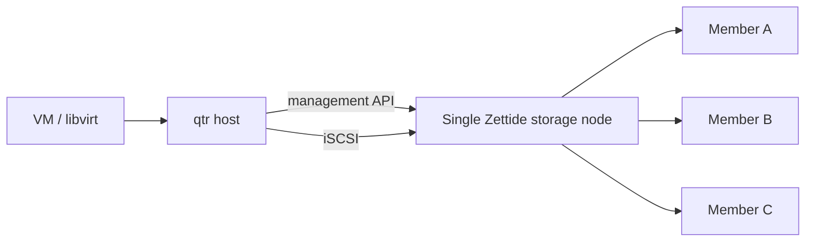
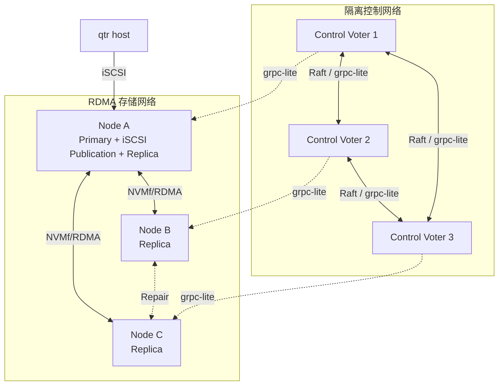

# 部署与网络

> 状态：Tier 1 当前部署边界；Tier 2/3 目标参考部署

## Tier 1 部署

Tier 1 是单机 foreground FUSE 进程。它访问一个 container file，或独占一个/三个显式选择的 raw devices，不开放 storage network port。

可选的 `zettide serve dufs` 会在命令生命周期内启动外部 dufs，并按透传参数监听 HTTP/WebDAV。监听地址、认证、TLS 与访问控制均由 dufs 配置；它不是 Tier 1 的必需组件，也不改变底层 target 的本地访问模型。

## Tier 2 参考拓扑

qtr host 与 storage node 可以同机或位于可信存储网络。多 Member 只提供设备级保护；整个 Zettide node 是 Tier 2 的单故障点。

## Tier 3 参考拓扑

三个 control voter 是参考规模；实际使用奇数 voter，并跨独立故障域部署。默认 3/2 profile 的三个数据 Replica 必须跨三个主机故障域，不能只满足逻辑副本数。首版 iSCSI publication 与 primary 共置；primary failover 时在新 primary 重建 publication。

## 网络平面

| 网络 | 流量 | 要求 |
| --- | --- | --- |
| 管理网络 | 部署、升级、诊断 | 限制管理员访问 |
| 控制网络 | Raft、管理 RPC、registration、heartbeat | 双向可达、低抖动、严格 ACL |
| 存储网络 | NVMf Replica I/O、resync、scrub | RDMA capable、足够带宽、拥塞隔离 |
| VM storage 网络 | qtr host 到 Zettide publication 的 iSCSI | 稳定可达、严格 ACL、与租户流量隔离 |
| 业务网络 | 应用和租户流量 | 不直接访问内部控制/Replica 端口 |

共享物理链路时仍需 VLAN/VRF、QoS 和防火墙隔离，避免业务突发饿死 Raft heartbeat、lease renewal 或同步复制。

控制路径可达不表示 NVMf 数据路径可用；heartbeat、RDMA path 和介质健康分别观测。

## NVMf/RDMA

目标优先使用 NVMf/RDMA。部署系统在 registration 中记录 NIC、provider 和端到端兼容能力，只把能够互通的节点放入同一 Replica 路径。

RDMA fabric 可以采用 InfiniBand、RoCE，或在具备兼容 RNIC、verbs provider 和网络栈时采用 iWARP。SPDK 配置使用统一的 `RDMA` transport；iWARP 不是一个独立 SPDK transport，也不是普通 TCP socket fallback。没有任何 RDMA 能力的环境不满足本架构的首选数据面条件，是否增加 NVMf/TCP fallback 需要独立决策。

- Transport 切换通过关闭旧连接、建立新连接和状态校验完成。
- 不能把两个 transport 上的重复 completion 统计为两个 Replica ack。
- 切换 transport 不改变 primary、epoch 或 committed boundary。
- 一次在途 I/O 不透明迁移 transport。

## 节点要求

DataService 节点至少持久化：

- Stable node ID 和 cluster binding。
- Member/Replica identity 和 generation。
- Replica `max_accepted_epoch`。
- 本地 journal/position 和恢复 manifest。
- Tier 2 本地 publication authority；Tier 3 从 Raft 恢复的 publication authority revision，以及本机最高 installed access generation、access mode 和 ACL/credential revision。

运行环境需要：

- SPDK 所需 hugepages、设备权限和 CPU/reactor 规划。
- NVMf/RDMA NIC、provider、驱动和路由配置。
- 防止同一设备被内核 block path 与 SPDK 非法并发占用。
- 独立的 control data directory 和数据介质。

## 启动顺序

Tier 2 启动先恢复本地 Pool/catalog、publication identity 和最高 access generation，安装当前 ACL/credential revision 并拒绝旧 generation，再启动 SPDK/iSCSI target，最后允许 qtr reconcile session 和 libvirt attachment。不得在 catalog authority、目标 Volume backend 或 publication fencing state 未验证时发布 LUN。

Tier 3 启动顺序：

1. 验证控制/存储网络隔离和端到端 RDMA 能力。
2. 启动保留既有持久状态的 control voters。
3. 恢复 Raft quorum、WAL、snapshot 和 registration。
4. 选出 leader 并完成 ReadIndex。
5. DataService 恢复本地 identity、Replica facts/epoch 和最高 installed publication generation；在取得当前 Raft publication authority 前拒绝所有 publication I/O。
6. 启动 SPDK runtime，但尚不开放可写 namespace。
7. DataService 注册或 heartbeat，reconciler 比较 desired/observed state。
8. 为 Volume 完成 lease、fencing quorum 和数据边界验证。
9. Primary 建立内部 Replica NVMf session。
10. 验证 Raft publication target/authority、active primary lease 和 Volume epoch，安装当前 ACL/credential revision与 access generation，qtr reconcile attachment 后恢复 VM block I/O。
11. 后台恢复第三 Replica 和完整冗余。

DataService 不得先开放写路径，再等待控制面确认权限。

## 可观测性

| 领域 | 关键指标/状态 |
| --- | --- |
| Raft | leader、term、commit/applied index、quorum |
| Registration | 节点、能力、故障域、管理状态、revision |
| Heartbeat | incarnation、last observation、path health |
| Lease | holder、epoch、安全窗口、renew result |
| Replication | 合格副本数、committed/applied position、ack latency |
| Fencing | 每个 Replica max epoch、barrier progress |
| Repair | source/target、dirty bytes、verification progress |
| NVMf | transport、namespace、qpair、reconnect/error state |
| Protection | 可写性与当前冗余级别 |

“业务可写”和“完整三副本已恢复”分别报告。

## 当前差距

当前没有统一 daemon、部署清单、managed iSCSI target、RDMA capability registration、防火墙模板、qtr attachment reconciliation 或 NVMf target 生命周期编排。`zettide` 已有 managed SPDK runtime/bdev/provider/vhost focused tests，但它们不是产品部署方案。
